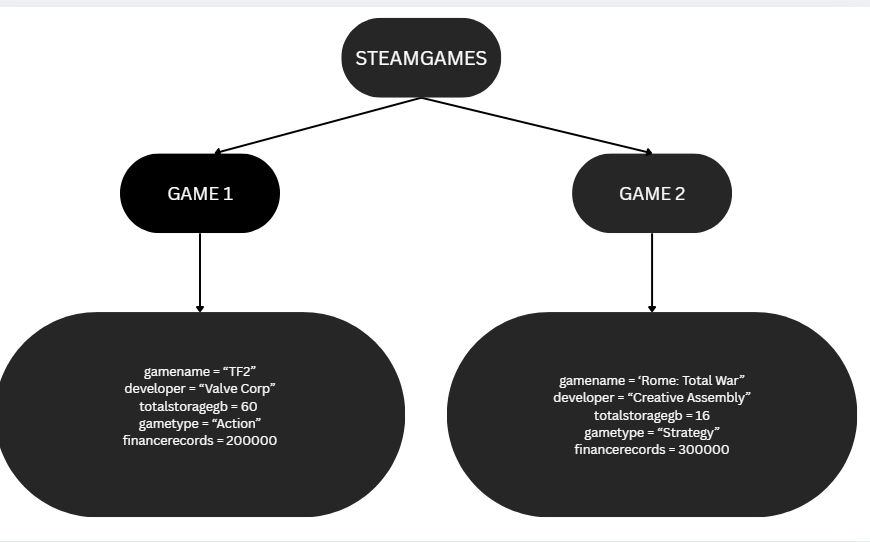
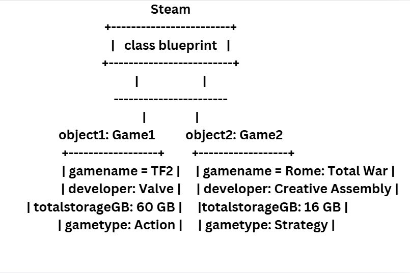

# Previous Work
# Link to my previous activity
[View OOPAct](q1/classObjectUML.md)

## Design Revision
Changes from my previous design:
- Renamed the class from generic `Steam` to `SteamGame` to explicitly identify it as a blueprint for individual games.
- Updated attribute names to follow standard Python naming conventions (`gamename`, `developer`, `gametype`).
- Replaced `Amount of bits` with `totalstoragegb` (integer) for clearer representation of required storage.
- Added a private integer attribute `financerecords` to keep track of whether the game session is active.

## Visibility Decisions
|   Attribute   | Data Type | Visibility |                               Reason                                    |
|---------------|-----------|------------|-------------------------------------------------------------------------|
|+GameName      | String    | Public     | A general attribute that can be accessed from outside the class         |
|+Developer     | String    | Public     | A general attribute that can be accessed from outside the class         |
|+TotalStorageGB| Integer   | Public     | A general attribute that can be accessed from outside the class         |
|+GameType      | String    | Public     | A general attribute that can be accessed from outside the class         |
|-FinanceRecords| Integer   | Private    | A sensitive attribute that should not be accessed from outside the class|

## Updated UML Class Diagram

## Python Implementation

[View Python Source](classImplementation.py)
## Test Run

## Object Diagram

## Analysis

### Why did you make your chosen attribute private?
I made FinanceRecords private because it is a senstive attribute of the game and its developers that when accessed, can be exploited and used against them.
 
### Which method changes the state of your object?
The method that changes the state of my object is the save, because when a game is saved, the file is then stored inside the game's files.

### How did your two objects demonstrate that instances are independent?
Instances are independent because when I call save, it only affects or updates itself in the files and does not affect other files. Example, when I call save to save game1 and make savefile1, it does not affect other savefiles.

### What is the difference between your class diagram and your object diagram?
The class diagram is the abstract blueprint of the system, which shows the structure, along with its attributes and methods, while object diagram represents a
concrete runtime snapshot of that system at a specific moment in time. In my class, the class diagram shows all the games attributes and methods, while the object diagram shows the instances and the current state of its attributes. Example, a game called TF2 was developed by Valve Corp, has a storage of 30 GB, and is an Action Game, while the game called Rome:Total War was developed by Creative Assembly, has a storage of 16 GB, and is a Strategy Game.
